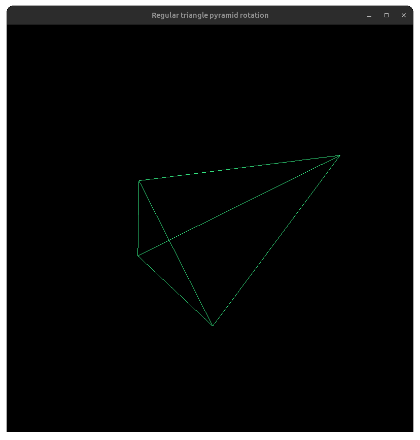

# Regular triangle pyramid rotation

This task was encountered in the computational mathematics course of 
[LETI](https://etu.ru/en).

[GLUT library](http://www.opengl.org/resources/libraries/glut/) installation requires.

#### Demo:

